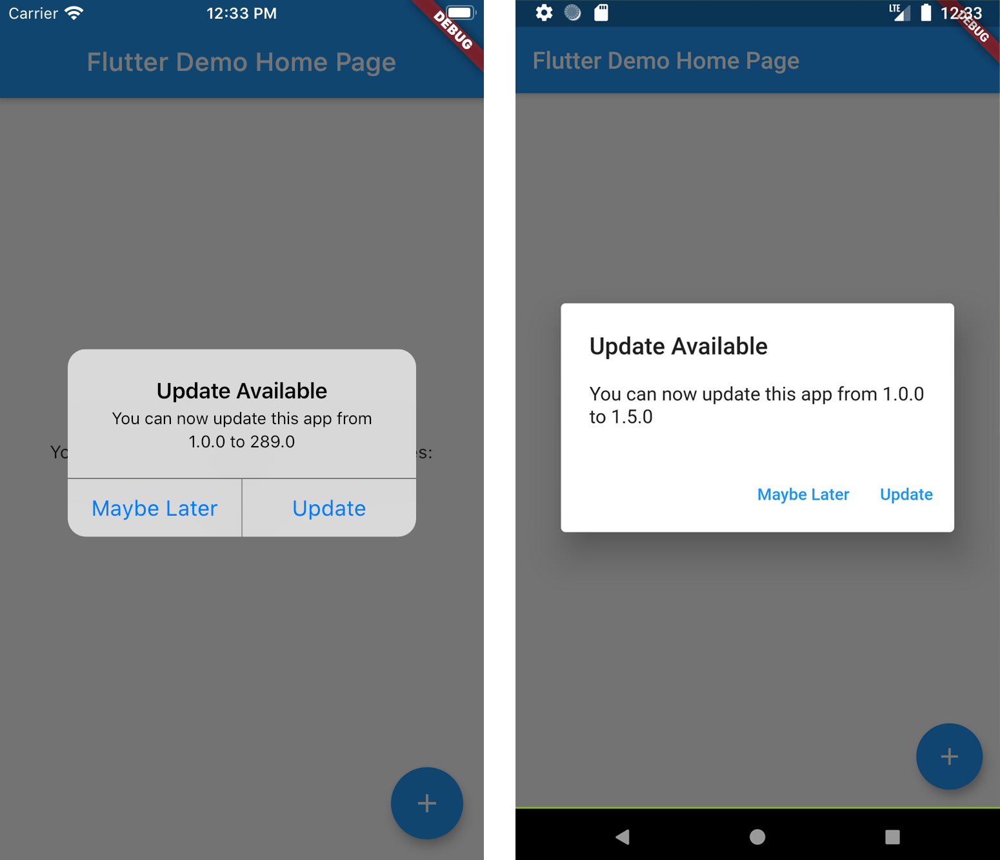

# New Version Plugin 🎉

A Flutter plugin that makes it possible to: 
* Check if a user has the most recent version of your app installed.
* Show the user an alert with a link to the appropriate app store page.

See more at the [Dart Packages page.](https://pub.dartlang.org/packages/new_version)



## Installation
Add new_version as [a dependency in your `pubspec.yaml` file.](https://flutter.io/using-packages/)
```
dependencies:
  new_version: ^0.0.5
```

## Usage
In `main.dart` (or wherever your app is initialized), create an instance of `NewVersion` using your current build context.
`final newVersion = NewVersion(context)`.

The plugin will automatically use your Flutter package identifier to check the app store. If your app has a differnet identifier in the Google Play Store or Apple App Store, you can overwrite this by providing values for `androidId` and/or `iOSId`.

You can use then use the plugin in two ways.

### Quickstart
Calling `showAlertIfNecessary` will check if the app can be updated, and will automatically dispaly a platform-specific alert that the user can use to go to the app store.

`newVersion.showAlertIfNecessary();`

### Advanced 😎
If you want to create a custom alert or use the app version information differently, call `getVersionStatus`. This will return a `VersionStatus` Future with information about the local and app store versions of the app.
```
final status = await newVersion.getVersionStatus();
status.canUpdate // (true)
status.localVersion // (1.2.1)
status.storeVersion // (1.2.3)
status.appStoreLink // (https://itunes.apple.com/us/app/google/id284815942?mt=8)
```

### Options
`BuildContext context`
This is required to check the user's platform and display alert dialogs.

`String androidId`
An optional value that can override the default packageName when attempting to reach the Google Play Store. This is useful if your app has a different package name in the Play Store.

`String iOSId`
An optional value that can override the default packageName when attempting to reach the Apple App Store. This is useful if your app has a different package name in the App Store.

`VoidCallback dismissAction`
An optional value that can override the default callback to dismiss button.

`String dialogText`
An optional value that can override the default text to alert, you can ${versionStatus.localVersion} to ${versionStatus.storeVersion} to determinate in the text a versions.

`String dialogTitle`
An optional value that can override the default title of alert dialog.

`String dismissText`
An optional value that can override the default text of dismiss button.

`String updateText`
An optional value that can override the default text of update button.

`String iOSAppStoreCountry`
Only affects iOS App Store lookup: The two-letter country code for the store you want to search. Provide a value here if your app is only available outside the US. For example: US. The default is US. See http://en.wikipedia.org/wiki/ ISO_3166-1_alpha-2 for a list of ISO Country Codes.